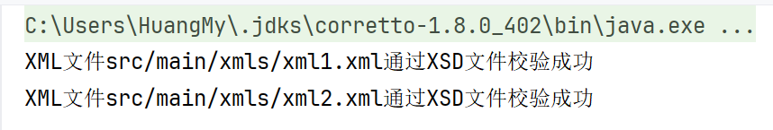

## 项目介绍  
### Schema设计  
#### 学生信息schema  
**src/main/xsds/studentMessege.xsd**  
```xml  
<xs:schema xmlns:xs="http://www.w3.org/2001/XMLSchema" targetNamespace="http://www.example.com/student" xmlns:student="http://www.example.com/student">
    <xs:element name="student">
        <xs:complexType>
            <xs:sequence>
                <xs:element name="studentId" type="xs:string"/>
                <xs:element name="name" type="xs:string"/>
                <xs:element name="gender" type="xs:string"/>
                <xs:element name="birth" type="xs:date"/>
                <xs:element name="grade" type="xs:string"/>
                <xs:element name="class" type="xs:string"/>
            </xs:sequence>
        </xs:complexType>
    </xs:element>
</xs:schema>
```  
#### 上课签到schema  
**src/main/xsds/present.xsd**  
```xml
<xs:schema xmlns:xs="http://www.w3.org/2001/XMLSchema" targetNamespace="http://www.example.com/attendance" xmlns:attendance="http://www.example.com/attendance">
    <xs:element name="attendance">
        <xs:complexType>
            <xs:sequence>
                <xs:element name="studentId" type="xs:string"/>
                <xs:element name="name" type="xs:string"/>
                <xs:element name="gender" type="xs:string"/>
                <xs:element name="class" type="xs:string"/>
                <xs:element name="status" type="xs:string"/>
                <xs:element name="timestamp" type="xs:dateTime"/>
            </xs:sequence>
        </xs:complexType>
    </xs:element>
</xs:schema>
```  
### 合法性验证  
**src/main/java/XMLValidate**  
```java
import org.dom4j.Document;
import org.dom4j.io.OutputFormat;
import org.dom4j.io.SAXReader;
import org.dom4j.io.SAXValidator;
import org.dom4j.io.XMLWriter;
import org.dom4j.util.XMLErrorHandler;

import javax.xml.parsers.SAXParser;
import javax.xml.parsers.SAXParserFactory;
import java.io.File;

public class XMLValidate {
    public static void main(String[] args) {
        String xml1 ="src/main/xmls/xml1.xml";
        String xsd1 = "src/main/xsds/studentMessage.xsd";
        String xml2 = "src/main/xmls/xml2.xml";
        String xsd2 = "src/main/xsds/present.xsd";
        validateXMLByXSD(xml1,xsd1);
        validateXMLByXSD(xml2,xsd2);
    }

    public static void validateXMLByXSD(String xml, String xsd){
        String xmlFileName = xml;
        String xsdFileName = xsd;
        try {
            XMLErrorHandler errorHandler = new XMLErrorHandler();
            SAXParserFactory factory = SAXParserFactory.newInstance();
            // 解析器验证XML内容
            factory.setValidating(true);
            factory.setNamespaceAware(true);

            SAXParser parser = factory.newSAXParser();
            SAXReader xmlReader = new SAXReader();
            Document xmlDocument = (Document) xmlReader.read(new File(xmlFileName));
            parser.setProperty(
                    "http://java.sun.com/xml/jaxp/properties/schemaLanguage",
                    "http://www.w3.org/2001/XMLSchema");
            parser.setProperty(
                    "http://java.sun.com/xml/jaxp/properties/schemaSource",
                    "file:" + xsdFileName);
            SAXValidator validator = new SAXValidator(parser.getXMLReader());
            validator.setErrorHandler(errorHandler);
            validator.validate(xmlDocument);

            XMLWriter writer = new XMLWriter(OutputFormat.createPrettyPrint());
            if (errorHandler.getErrors().hasContent()) {
                System.out.println("XML文件" + xmlFileName + "通过XSD文件校验失败");
                writer.write(errorHandler.getErrors());
            } else {
                System.out.println("XML文件" + xmlFileName + "通过XSD文件校验成功");
            }
        } catch (Exception e) {
            System.out.println("XML文件" + xmlFileName + "通过XSD文件校验失败");
            e.printStackTrace();
        }
    }
}
```   
### 以学生个人为聚合的成绩报告单  
#### 成绩报告单schema  
**src/main/xsds/studentGrades.xsd**  
```xml
<xs:schema xmlns:xs="http://www.w3.org/2001/XMLSchema">
    <xs:element name="studentReport">
        <xs:complexType>
            <xs:sequence>
                <xs:element name="student" maxOccurs="unbounded">
                    <xs:complexType>
                        <xs:sequence>
                            <xs:element name="studentId" type="xs:string"/>
                            <xs:element name="name" type="xs:string"/>
                            <xs:element name="gender" type="xs:string"/>
                            <xs:element name="birth" type="xs:date"/>
                            <xs:element name="grade" type="xs:int"/>
                            <xs:element name="class" type="xs:string"/>
                            <xs:element name="course" maxOccurs="5">
                                <xs:complexType>
                                    <xs:sequence>
                                        <xs:element name="courseName" type="xs:string"/>
                                        <xs:element name="dailyScore" type="xs:decimal"/>
                                        <xs:element name="finalScore" type="xs:decimal"/>
                                        <xs:element name="totalScore" type="xs:decimal"/>
                                    </xs:sequence>
                                </xs:complexType>
                            </xs:element>
                        </xs:sequence>
                    </xs:complexType>
                </xs:element>
            </xs:sequence>
        </xs:complexType>
    </xs:element>
</xs:schema>
```  
#### DOM读取XML并生成其他成绩  
**src/main/java/GenerateStudentGrades.java**  
```java
import org.w3c.dom.Document;
import org.w3c.dom.Element;

import javax.xml.parsers.DocumentBuilder;
import javax.xml.parsers.DocumentBuilderFactory;
import javax.xml.transform.Transformer;
import javax.xml.transform.TransformerFactory;
import javax.xml.transform.dom.DOMSource;
import javax.xml.transform.stream.StreamResult;
import java.io.File;
import java.util.Random;

public class GenerateStudentGrades {
    public static void main(String[] args) {
        try {
            DocumentBuilderFactory factory = DocumentBuilderFactory.newInstance();
            DocumentBuilder builder = factory.newDocumentBuilder();
            Document doc = builder.parse("src/main/xmls/xml1.xml");

            Document newDoc = builder.newDocument();
            Element root = newDoc.createElement("students");
            newDoc.appendChild(root);

            Element originalStudent = newDoc.createElement("student");
            root.appendChild(originalStudent);

            Element studentIdElement = newDoc.createElement("studentId");
            studentIdElement.appendChild(newDoc.createTextNode(doc.getElementsByTagName("studentId").item(0).getTextContent()));
            originalStudent.appendChild(studentIdElement);

            Element nameElement = newDoc.createElement("name");
            nameElement.appendChild(newDoc.createTextNode(doc.getElementsByTagName("name").item(0).getTextContent()));
            originalStudent.appendChild(nameElement);

            Element genderElement = newDoc.createElement("gender");
            genderElement.appendChild(newDoc.createTextNode(doc.getElementsByTagName("gender").item(0).getTextContent()));
            originalStudent.appendChild(genderElement);

            Element birthElement = newDoc.createElement("birth");
            birthElement.appendChild(newDoc.createTextNode(doc.getElementsByTagName("birth").item(0).getTextContent()));
            originalStudent.appendChild(birthElement);

            Element gradeElement = newDoc.createElement("grade");
            gradeElement.appendChild(newDoc.createTextNode(doc.getElementsByTagName("grade").item(0).getTextContent()));
            originalStudent.appendChild(gradeElement);

            Element classElement = newDoc.createElement("class");
            classElement.appendChild(newDoc.createTextNode(doc.getElementsByTagName("class").item(0).getTextContent()));
            originalStudent.appendChild(classElement);

            // 随机生成五门课程的成绩
            Random random = new Random();
            for (int i = 0; i < 5; i++) {
                Element courseElement = newDoc.createElement("course");
                originalStudent.appendChild(courseElement);

                Element courseNameElement = newDoc.createElement("courseName");
                courseNameElement.appendChild(newDoc.createTextNode("Course" + (i + 1)));
                courseElement.appendChild(courseNameElement);

                Element dailyScoreElement = newDoc.createElement("dailyScore");
                dailyScoreElement.appendChild(newDoc.createTextNode(String.valueOf(random.nextInt(101))));
                courseElement.appendChild(dailyScoreElement);

                Element finalScoreElement = newDoc.createElement("finalScore");
                finalScoreElement.appendChild(newDoc.createTextNode(String.valueOf(random.nextInt(101))));
                courseElement.appendChild(finalScoreElement);

                int totalScore = (Integer.parseInt(dailyScoreElement.getTextContent()) + Integer.parseInt(finalScoreElement.getTextContent())) / 2;
                Element totalScoreElement = newDoc.createElement("totalScore");
                totalScoreElement.appendChild(newDoc.createTextNode(String.valueOf(totalScore)));
                courseElement.appendChild(totalScoreElement);
            }

            // 随机生成9名学生信息
            for (int j = 0; j < 9; j++) {
                Element student = newDoc.createElement("student");
                root.appendChild(student);

                Element randomStudentIdElement = newDoc.createElement("studentId");
                randomStudentIdElement.appendChild(newDoc.createTextNode("NJU" + (j + 2) + "130"));
                student.appendChild(randomStudentIdElement);

                Element randomNameElement = newDoc.createElement("name");
                randomNameElement.appendChild(newDoc.createTextNode("STUDENT" + (j + 2)));
                student.appendChild(randomNameElement);

                Element randomGenderElement = newDoc.createElement("gender");
                randomGenderElement.appendChild(newDoc.createTextNode(j % 2 == 0 ? "男" : "女"));
                student.appendChild(randomGenderElement);

                Element randomBirthElement = newDoc.createElement("birth");
                randomBirthElement.appendChild(newDoc.createTextNode("2004-0" + (j + 2) + "-01"));
                student.appendChild(randomBirthElement);

                Element randomGradeElement = newDoc.createElement("grade");
                randomGradeElement.appendChild(newDoc.createTextNode(doc.getElementsByTagName("grade").item(0).getTextContent()));
                student.appendChild(randomGradeElement);

                Element randomClassElement = newDoc.createElement("class");
                randomClassElement.appendChild(newDoc.createTextNode(doc.getElementsByTagName("class").item(0).getTextContent()));
                student.appendChild(randomClassElement);

                // 随机生成五门课程的成绩
                for (int k = 0; k < 5; k++) {
                    Element courseElement = newDoc.createElement("course");
                    student.appendChild(courseElement);

                    Element courseNameElement = newDoc.createElement("courseName");
                    courseNameElement.appendChild(newDoc.createTextNode("Course" + (k + 1)));
                    courseElement.appendChild(courseNameElement);

                    Element dailyScoreElement = newDoc.createElement("dailyScore");
                    dailyScoreElement.appendChild(newDoc.createTextNode(String.valueOf(random.nextInt(101))));
                    courseElement.appendChild(dailyScoreElement);

                    Element finalScoreElement = newDoc.createElement("finalScore");
                    finalScoreElement.appendChild(newDoc.createTextNode(String.valueOf(random.nextInt(101))));
                    courseElement.appendChild(finalScoreElement);

                    int totalScore = (Integer.parseInt(dailyScoreElement.getTextContent()) + Integer.parseInt(finalScoreElement.getTextContent())) / 2;
                    Element totalScoreElement = newDoc.createElement("totalScore");
                    totalScoreElement.appendChild(newDoc.createTextNode(String.valueOf(totalScore)));
                    courseElement.appendChild(totalScoreElement);
                }
            }

            // 输出生成的学生信息到xml3.xml文件
            TransformerFactory transformerFactory = TransformerFactory.newInstance();
            Transformer transformer = transformerFactory.newTransformer();
            transformer.setOutputProperty("indent", "yes");
            transformer.setOutputProperty("{http://xml.apache.org/xslt}indent-amount", "2");
            DOMSource source = new DOMSource(newDoc);
            StreamResult result = new StreamResult(new File("src/main/xmls/xml3.xml"));
            transformer.transform(source, result);

            System.out.println("生成的学生信息已保存到xml3.xml文件中");

        } catch (Exception e) {
            e.printStackTrace();
        }
    }
}
```  
### 以课程为聚合的成绩报告单并转化XML4  
#### 成绩报告单schema  
**src/main/xsds/courseReport.xsd**  
```xml
<xs:schema xmlns:xs="http://www.w3.org/2001/XMLSchema">
    <xs:element name="courseReport">
        <xs:complexType>
            <xs:sequence>
                <xs:element name="course" maxOccurs="unbounded">
                    <xs:complexType>
                        <xs:sequence>
                            <xs:element name="courseName" type="xs:string"/>
                            <xs:element name="averageScore" type="xs:decimal"/>
                            <xs:element name="studentScores" maxOccurs="unbounded">
                                <xs:complexType>
                                    <xs:sequence>
                                        <xs:element name="studentId" type="xs:string"/>
                                        <xs:element name="name" type="xs:string"/>
                                        <xs:element name="totalScore" type="xs:decimal"/>
                                    </xs:sequence>
                                </xs:complexType>
                            </xs:element>
                        </xs:sequence>
                    </xs:complexType>
                </xs:element>
            </xs:sequence>
        </xs:complexType>
    </xs:element>
</xs:schema>
```  
#### 转化文件  
**src/main/java/XML3ToXML4.xslt**  
```xml
<?xml version="1.0" encoding="UTF-8"?>
<xsl:stylesheet version="1.0" xmlns:xsl="http://www.w3.org/1999/XSL/Transform">
    <xsl:output method="xml" version="1.0" encoding="UTF-8" indent="yes"/>

    <xsl:key name="courseKey" match="course" use="courseName"/>

    <xsl:template match="/students">
        <courses>
            <xsl:for-each select="student/course[generate-id() = generate-id(key('courseKey', courseName)[1])]">
                <xsl:sort select="sum(key('courseKey', courseName)/totalScore) div count(key('courseKey', courseName))" data-type="number" order="descending"/>
                <xsl:variable name="currentCourse" select="courseName"/>
                <course>
                    <courseName><xsl:value-of select="courseName"/></courseName>
                    <xsl:for-each select="key('courseKey', $currentCourse)">
                        <student>
                            <studentId><xsl:value-of select="../studentId"/></studentId>
                            <studentName><xsl:value-of select="../name"/></studentName>
                            <totalScore><xsl:value-of select="totalScore"/></totalScore>
                        </student>
                    </xsl:for-each>
                    <averageScore>
                        <xsl:value-of select="format-number(sum(key('courseKey', $currentCourse)/totalScore) div count(key('courseKey', $currentCourse)), '#.##')"/>
                    </averageScore>
                </course>
            </xsl:for-each>
        </courses>
    </xsl:template>
</xsl:stylesheet>
```  
### 采用SAX处理XML4
**src/main/java/XMLFilter.java**  
```java
import org.xml.sax.Attributes;
import org.xml.sax.SAXException;
import org.xml.sax.helpers.DefaultHandler;

import javax.xml.parsers.SAXParser;
import javax.xml.parsers.SAXParserFactory;
import java.io.File;
import java.io.FileWriter;
import java.io.IOException;

public class XMLFilter extends DefaultHandler {
    private FileWriter writer;
    private StringBuilder currentCourse;
    private StringBuilder currentStudent;
    private String currentElement;
    private boolean isLowScore;
    private boolean hasLowScore;

    public XMLFilter() {
        try {
            writer = new FileWriter("src/main/xmls/xml5.xml");
            writer.write("<?xml version=\"1.0\" encoding=\"UTF-8\"?>\n<courses>\n");
        } catch (IOException e) {
            e.printStackTrace();
        }
    }

    @Override
    public void startElement(String uri, String localName, String qName, Attributes attributes) throws SAXException {
        currentElement = qName;
        if (qName.equals("course")) {
            currentCourse = new StringBuilder();
            hasLowScore = false;
        } else if (qName.equals("student")) {
            currentStudent = new StringBuilder();
        }
    }

    @Override
    public void endElement(String uri, String localName, String qName) throws SAXException {
        if (qName.equals("course")) {
            if(hasLowScore){
                try {
                    writer.write("<course>\n");
                    writer.write(currentCourse.toString());
                    writer.write("</course>\n");
                } catch (IOException e) {
                    e.printStackTrace();
                }
            }
            isLowScore = false;
        } else if (qName.equals("student")) {
            if (isLowScore) {
                currentCourse.append(currentStudent.toString());
            }
        }
    }

    @Override
    public void characters(char[] ch, int start, int length) throws SAXException {
        String data = new String(ch, start, length).trim();
        if (currentElement.equals("courseName")) {
            currentCourse.append(data).append("\n");
        } else if (currentElement.equals("studentId")) {
            currentStudent.append(data).append("    ");
        } else if (currentElement.equals("studentName")) {
            currentStudent.append(data).append("    ");
        } else if (currentElement.equals("totalScore")) {
            if (data.matches("\\d+")) {
                int score = Integer.parseInt(data);
                if (score < 60) { System.out.println(score);
                    isLowScore = true;
                    hasLowScore = true;
                    currentStudent.append(data).append("\n");
                }
                else {
                    currentStudent = new StringBuilder();
                }
            }
        }
    }

    @Override
    public void endDocument() throws SAXException {
        try {
            writer.write("</courses>");
            writer.close();
        } catch (IOException e) {
            e.printStackTrace();
        }
    }

    public static void main(String[] args) {
        try {
            SAXParserFactory factory = SAXParserFactory.newInstance();
            SAXParser saxParser = factory.newSAXParser();
            XMLFilter handler = new XMLFilter();
            saxParser.parse(new File("src/main/xmls/xml4.xml"), handler);
        } catch (Exception e) {
            e.printStackTrace();
        }
    }
}
```  
## 项目结果部分截图  
### XML格式验证  
  
### XML5  

